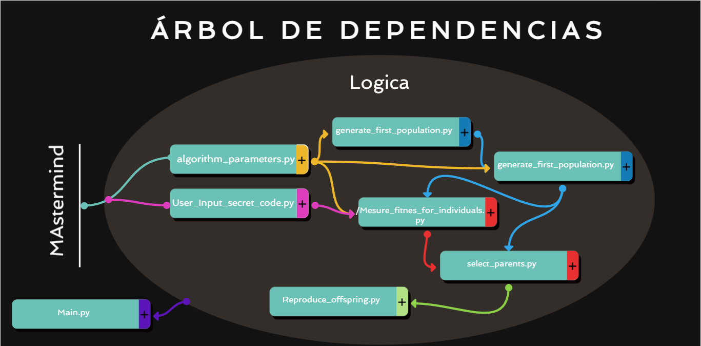
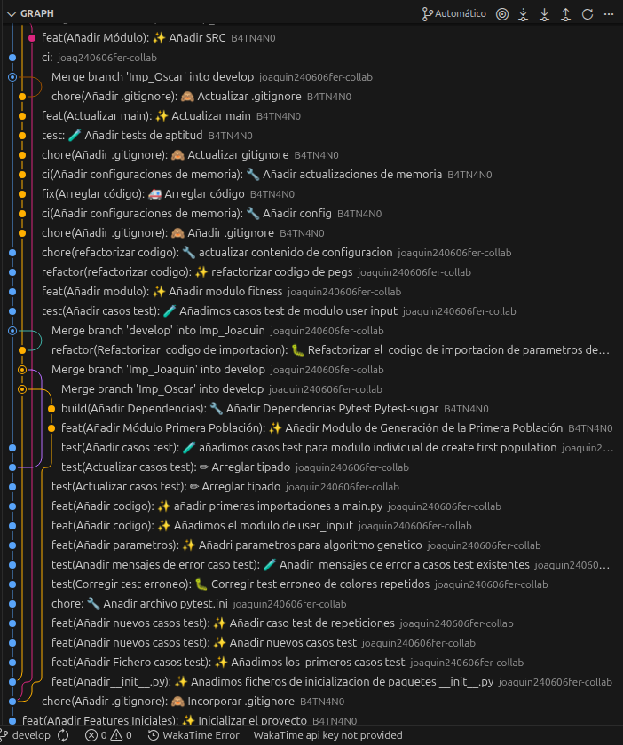

# Mastermind GA: Genetic Algorithm Solver #
---

## Tabla de Contenidos ##
[Descripción General](https://github.com/B4TN4N0/Proyecto-Mastermind.git)

[Arquitectura del Sistema](https://github.com/B4TN4N0/Proyecto-Mastermind.git)

[Configuración del Experimento](https://github.com/B4TN4N0/Proyecto-Mastermind/blob/cbe21fc17277f657d6bf6c1810124639a88cc8d1/pyproject.toml)

[Lógica del Algoritmo Genético](https://github.com/B4TN4N0/Proyecto-Mastermind/tree/cbe21fc17277f657d6bf6c1810124639a88cc8d1/src)

[Interfaz de Usuario CLI](https://github.com/B4TN4N0/Proyecto-Mastermind/blob/cbe21fc17277f657d6bf6c1810124639a88cc8d1/main.py))

[Instalación y Uso](https://github.com/B4TN4N0/Proyecto-Mastermind.git)

[Análisis de Resultados](https://github.com/B4TN4N0/Proyecto-Mastermind.git)

---
## Sobre el Juego ##
Mastermind es un juego de lógica donde un "Creador de Código" (el usuario) elige una combinación secreta, y un "Descifrador" (la IA) intenta adivinarla. En cada intento, el sistema proporciona pistas:

Puntos Negros: Colores correctos en la posición correcta.

Puntos Blancos: Colores correctos en la posición incorrecta.

--- 

## Instrucciones de Juego ##
Al iniciar, verás el Menú de Colores disponibles (8 opciones).

El sistema te pedirá ingresar tu Código Secreto de 4 dígitos (ej: 1 2 5 8).

Una vez establecido, el Algoritmo Genético comenzará su proceso de evolución.

Observa cómo cada generación se acerca más a tu código hasta lograr el "Match" perfecto.

---
## Características Técnicas ##

El núcleo de este proyecto reside en su Algoritmo Genético, configurado con los siguientes parámetros técnicos:
| Parámetro | Valor | Descripción |
| :--- | :--- | :--- |
| **Población** | `100` | Individuos por generación. |
| **Genes de Color** | `8` | Red, Green, Blue, Purple, Yellow, White, Pink, Orange. |
| **Longitud del Código** | `4` | Tamaño de la combinación a adivinar. |
| **Mutación** | `0.05` | Probabilidad de alteración genética aleatoria. |
---

## Componentes Genéticos ##
[Selección](https://github.com/B4TN4N0/Proyecto-Mastermind/blob/cbe21fc17277f657d6bf6c1810124639a88cc8d1/src/Mesure_fitnes_for_individuals.py): Evaluación de la aptitud (fitness) basada en la proximidad al código secreto.

[Crossover](https://github.com/B4TN4N0/Proyecto-Mastermind/blob/cbe21fc17277f657d6bf6c1810124639a88cc8d1/src/Reproduce_offspring.py): Combinación de ADN de los mejores "padres" para generar descendencia.

[Mutación](https://github.com/B4TN4N0/Proyecto-Mastermind/blob/cbe21fc17277f657d6bf6c1810124639a88cc8d1/src/algorithm_parameters.py): Introducción de variabilidad para evitar máximos locales.

--- 

Interfaz Visual
Inspirado en las versiones clásicas de aplicaciones móviles, la interfaz de consola utiliza códigos para simular un tablero de madera real:

Esferas de color: Representadas por bloques sólidos de alta visibilidad.

Tablero: Diseño estructurado con marcos y numeración de intentos.

---

## Estructura del Proyecto ##

## Estructura de Ramas ##

Para mantener un historial limpio y organizado, el proyecto utiliza un modelo de ramificación basado en cuatro niveles de jerarquía:
1. Rama main (Producción)

    Es la rama principal del proyecto.

    Solo contiene código estable y probado.

    No se trabaja directamente sobre ella. Solo recibe merges de develop cuando se alcanza un hito importante.

2. Rama develop (Integración)

    Es nuestra rama de trabajo diario y base para todas las nuevas funcionalidades.

    Aquí se integran los cambios terminados de cada miembro del equipo.

    Regla: Antes de subir nada aquí, el código debe pasar los tests (TDD).

3. Ramas Personales (Features)

Cada miembro del grupo dispone de una rama propia para desarrollar sus tareas asignadas sin interferir en el trabajo de los demás:

    imp_joaquin: Implementaciones y experimentos de Joaquín.

    imp_oscar: Implementaciones y experimentos de Oscar.

---
# Instalación y Uso #
## Requisitos previos ##

Python 3.11 o superior.

Terminal compatible con colores: Terminal de Linux, PowerShell o CMD moderno (Win 10/11).

Configuración del entorno

Es recomendable usar un entorno virtual para mantener las dependencias aisladas:
Bash

## Clonar el repositorio ##
git clone https://github.com/B4TN4N0/Proyecto-Mastermind.git
cd mastermind-ga

## Crear y activar entorno virtual ##
python -m venv venv

source venv/bin/activate 

En Windows: venv\Scripts\activate

## Configuración del Proyecto ##

El proyecto utiliza un archivo pyproject.toml para gestionar las dependencias de forma robusta.

## Instalación de dependencias ##

Para usuarios (solo jugar): Necesitarás las librerías base (como matplotlib para la interfaz gráfica ):

pip install .

Para desarrolladores (testing): Para instalar las herramientas de desarrollo como pytest y pytest-sugar:

pip install ".[dev]"

🧪 Pruebas Unitarias (Desarrollo)

Gracias a pytest-sugar, la ejecución de pruebas es visual y limpia.

# Ejecutar todos los tests

pytest

---
## Tiempo invertido ##

La inversion en tiempo para el proyecto fue de aproximadamente unas 21 horas con 40 minutos Adjunto una grafica de tiempo dedicado a cada modulo.

---

## Posibles Mejoras (Roadmap) ##
[ ] Implementar el algoritmo de Donald Knuth para comparar eficiencia contra el GA.

[ ] Exportación de estadísticas de convergencia a archivos .csv.

[ ] Interfaz gráfica de usuario (GUI) utilizando Tkinter o PyQt.

Desarrollado por: [Óscar Fernández Millan y Joaquín Fernández García]
